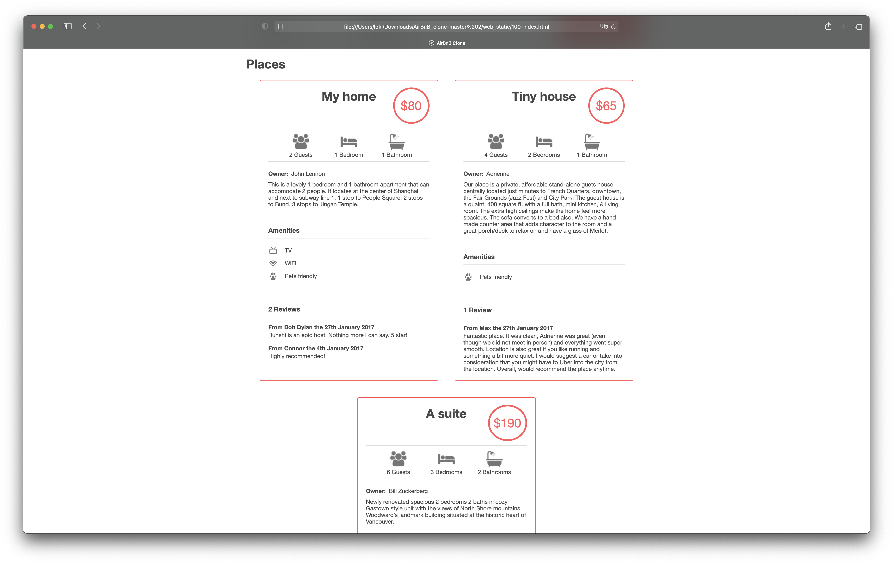

# Web Static

## General Idea

## A brief history

The World Wide Web was first concieved by Tim Berners-Lee[^1] in the year 1990[^2]. It was based on two main components:

* HTTP(*Hypertext Transfer Protocol*), that defined the communications[^3] between a client and a server
* HTML(*Hypertext Markup Language*), that gives a structure to the data

CSS(*Cascading Style Sheets*) was developed later in 1996 by Bert Bos and Håkon Wium Lie as a reponse to HTML's verbosity and low semantics.

[^1]: Was working in CERN when this happened. Founded the W3C(*World Wide Web Consortium*) later.
[^2]: On Christmas. **"This is for everyone"**
[^3]: Send & receive HTTP requests & responses, respectively

## Sidebar

This can be called the introduction to HTML, CSS and the Web! We'll be building the **View** section of the MVC(*Model View Control*) paradigm of Web Development.

Pretty amazing!! :grinning:
